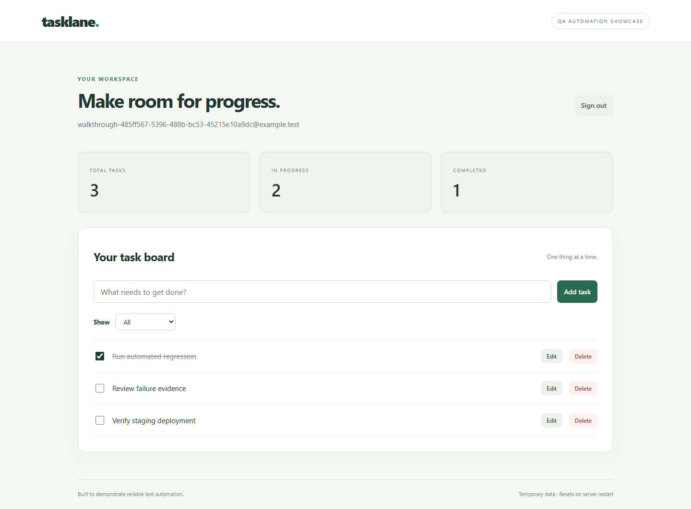
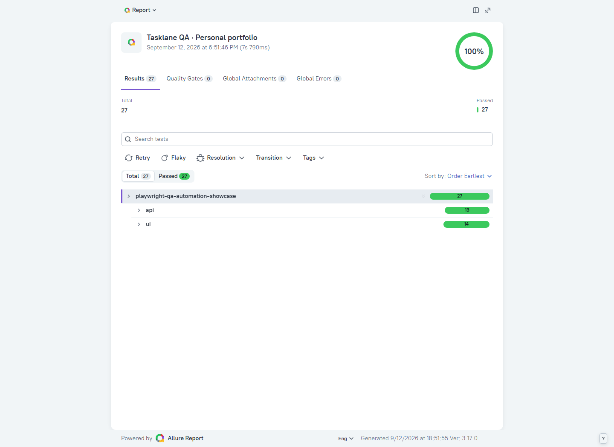
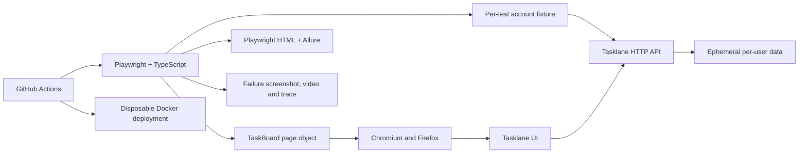

# Tasklane · QA automation showcase

[](https://github.com/khizarsheikh/playwright-qa-automation-showcase/actions/workflows/qa.yml)

**A working example of the service I can deliver: automated regression tests, CI integration, and useful failure reports.**

This personal portfolio project tests **Tasklane**, a small task-management application included in this repository. It demonstrates UI and API testing with TypeScript and Playwright, Allure reporting, and GitHub Actions workflows. It is a demonstration, not paid client work.



## The problem this project addresses

Teams need to know whether a release still supports their important user journeys. Manual checks alone are repetitive, and an unexplained red pipeline is difficult to investigate.

This repository provides reproducible checks for account access and task workflows, API-assisted test setup, isolated data, reports, and retained evidence when a test fails. The application is intentionally small so the automation decisions are easy to inspect.

## See the evidence

**Verified locally:** 27 passing tests (13 API + 14 Chromium UI), plus 5 passing checks against an independently started local target.

**Verified in GitHub Actions:** the Linux cross-browser regression passed in Chromium and Firefox, then the Docker image built and its five smoke checks passed against a disposable container. See the [verified workflow run](https://github.com/khizarsheikh/playwright-qa-automation-showcase/actions/runs/34702139179) and detailed record below.

- [Recorded application walkthrough](docs/assets/walkthrough.webm)
- [Test strategy and coverage](docs/test-strategy.md)
- [Verified local results and remaining checks](docs/verification.md)
- [Intentional failure example](docs/failure-walkthrough.md)
- [Client-facing case study](docs/case-study.md)
- [How to present this project in an interview](docs/demo-guide.md)



## Quick start

Prerequisite: Node.js 22 or newer (Node 24 is used in CI). Install Chromium through Playwright; Firefox is optional locally and included in Linux CI. Allure 3 runs on Node.js; Java is not required.

```sh
npm ci
npx playwright install chromium
npm run typecheck
npm test
npm run allure:generate
npm run allure:open
```

Playwright starts and stops the demo server automatically. Do not start another server on port 3000 before `npm test`.

To explore the app yourself:

```sh
npm start
```

Open `http://localhost:3000`, enter a fictional email and a password of at least eight characters, and select **Create demo account**. All data is stored in memory and disappears when the server stops.

### Commands

| Command | Purpose |
| --- | --- |
| `npm test` | All API tests and UI tests in Chromium |
| `npm run test:cross-browser` | Add Firefox to the full suite; install it first with `npx playwright install firefox` |
| `npm run test:smoke` | Critical tagged checks only |
| `npm run test:api` | API checks without launching a browser |
| `npm run test:ui` | Interactive Playwright test runner |
| `npm run typecheck` | TypeScript validation |
| `npm run report` | Open the latest Playwright HTML report |
| `npm run allure:generate` | Generate the latest Allure HTML report |
| `npm run test:failure-demo` | One deliberate failing assertion; exits nonzero |
| `npm run demo:record` | Start the demo and record screenshots/video; or use an existing `BASE_URL` |

Each run replaces the previous generated Allure results, and report generation removes stale output before writing a new report. Archive a report before starting another run if you need to retain it. The intentional failure is excluded from normal regression and smoke runs.

### If npm or the browser cache has Windows permission errors

Use a fresh cache inside this repository rather than changing system permissions:

```powershell
$env:npm_config_cache = Join-Path $PWD '.local/npm-cache'
$env:PLAYWRIGHT_BROWSERS_PATH = Join-Path $PWD '.local/browsers'
npm ci
npx playwright install chromium
npm test
```

Use the same `PLAYWRIGHT_BROWSERS_PATH` when installing and running browsers. `.local` is excluded from Git.

## Architecture



```text
app/                    Demo UI and Node.js API
tests/api/              API contracts, boundaries, authorization and cleanup
tests/ui/               User journeys and controlled failure demonstration
tests/pages/            TaskBoard page object
tests/support/          Fixtures and report cleanup
scripts/                Readiness check and portfolio recording
.github/workflows/      Regression, container smoke and manual staging smoke
docs/                   Strategy, case study, evidence and demo guide
```

## CI and deployment checks

The main workflow runs on pull requests, pushes to `main`, manual dispatch, and a daily schedule at **02:00 UTC (07:00 Pakistan time)**. GitHub schedules can be delayed and start only after publication on the default branch.

1. Install locked dependencies, check types, and run the full suite.
2. Generate reports and upload artifacts, including on test failure.
3. If regression passes, build a Docker image and start a disposable container.
4. Wait for `/api/health`, then run API/Chromium smoke tests against that deployment.
5. Upload smoke evidence and remove the container.

The container exists only within the CI job; this workflow does not publish or maintain a public site. A separate manual workflow accepts the URL of an existing **Tasklane staging environment you control**. Tests create and delete disposable accounts there.

To test an existing local deployment in PowerShell:

```powershell
$env:BASE_URL = 'http://127.0.0.1:3000'
node scripts/wait-for-app.mjs
npm run test:smoke -- --project=api --project=chromium
Remove-Item Env:BASE_URL
```

Setting `BASE_URL` disables the Playwright-managed server. For HTTPS staging, set `SECURE_COOKIES=true` on the app server. Do not point these tests at a production service or an unrelated website.

## Scope and limitations

- Tests cover the defined Tasklane flows, not every browser, accessibility requirement, or security property.
- Chromium is the default local desktop browser. Chromium and Firefox both passed in Linux CI. Firefox launch stalled in the original restricted Windows environment, which remains a local-environment limitation. Safari and mobile are not part of the regression matrix.
- API checks include ownership boundaries, but this is not a penetration test or security certification.
- In-memory storage, no rate limiting, no session expiry, and synchronous password hashing make the demo unsuitable as a production service.
- Failure screenshots/traces can contain test data. This project uses fictional identities; review artifacts before sharing results from a real client environment.
- A single successful run is evidence of that run, not a guarantee that tests can never be flaky.

## Tools and references

[Playwright documentation](https://playwright.dev/docs/intro) · [Allure Playwright](https://allurereport.org/docs/playwright/) · [Allure 3 installation](https://allurereport.org/docs/v3/install/) · [GitHub Actions documentation](https://docs.github.com/en/actions)

Dependencies are pinned in `package.json` and `package-lock.json`. Review and validate upgrades before changing the lockfile.
