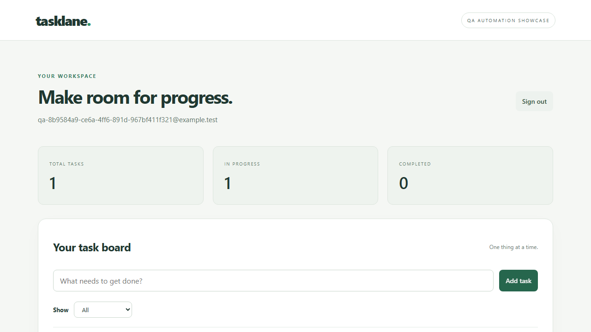

# Investigating an intentional failure

The normal regression suite excludes `tests/ui/failure-demo.spec.ts`.

Run the controlled example separately:

```sh
npm run test:failure-demo
npm run allure:generate
npm run report
```

The test creates an active task, then deliberately expects the completed-task count to be `1`. The actual count is `0`, so the assertion must fail and the command must return a nonzero exit code.

This demonstrates reporting behavior rather than an application defect. Inspect:



[Download the captured Playwright trace](assets/intentional-failure-trace.zip). This is a real local run, with fictional test data; it is not a client incident.

1. The failed assertion and expected/actual values.
2. The screenshot of the active task and zero completed count.
3. The trace's actions, DOM snapshots, and network requests.
4. The video showing the state before the failed assertion.

To open a saved trace, use `npx playwright show-trace` followed by its path in `test-results`. Do not mark the test as an expected failure to turn the build green; run the normal suite afterward to restore a passing report.

Generated reports contain fictional test identities and may contain demo session cookies. Do not reuse this artifact-sharing approach with client credentials without reviewing/redacting the contents.
